# 📱 LifeOps App Flow & User Journeys

> **Complete user experience mapping and workflow documentation for the AI-powered personal operating system**

---

## 🎯 Overview

LifeOps transforms how users manage their daily productivity by seamlessly integrating AI planning, context monitoring, and intentional living into a beautiful, action-oriented interface. The Minimal Focus UI provides the perfect foundation for this comprehensive personal operating system.

---

## 🌅 Core User Journeys

### 1. Morning Planning Journey

#### **Scenario:** User starts their day with LifeOps

```mermaid
flowchart TD
    A[Wake Up] --> B[Open LifeOps]
    B --> C[Voice: "Good morning, how are you feeling?"]
    C --> D[Mood Input via Voice/UI]
    D --> E[AI Analyzes Calendar + Context]
    E --> F[Generates Optimal Daily Plan]
    F --> G[Review Plan in Hero Section]
    G --> H[Adjust via Action Buttons]
    H --> I[Start First Pomodoro]
```

**UI Flow in Minimal Focus Layout:**

1. **Hero Section Welcome**
   ```
   ┌─────────────────────────────────────┐
   │ Good Morning! 🌅                    │
   │ Ready to make today intentional?    │
   │                                     │
   │ [🎯 Plan Day] [🎤 Voice Check-in]   │
   └─────────────────────────────────────┘
   ```

2. **Mood & Energy Input**
   - Voice: "I'm feeling energetic but a bit anxious about the presentation"
   - UI: Quick mood sliders or emoji selection
   - AI processes sentiment and energy level

3. **AI-Generated Plan Display**
   ```
   ┌─────────────────────────────────────┐
   │ Your Optimal Day                    │
   │ ─────────────────────                │
   │ 🔥 High Energy (9-11am)            │
   │   → Presentation prep (Big Task)    │
   │ ⚡ Medium Energy (11am-12pm)        │
   │   → Email responses (3 Medium)      │
   │ 🔄 Break & Lunch (12-1pm)          │
   │ 📝 Focus Time (1-3pm)              │
   │   → Design reviews (5 Small)       │
   │                                     │
   │ [✏️ Adjust] [🚀 Start Day]         │
   └─────────────────────────────────────┘
   ```

4. **Quick Stats Overview**
   ```
   ┌─────────────────────────────────────┐
   │  Today's Focus  │  Calendar  │ Mood │
   │      6.5h       │   4 events │  😊  │
   │  ↑12% vs avg    │  2 conflicts│ 7/10 │
   └─────────────────────────────────────┘
   ```

---

### 2. Work Session Journey

#### **Scenario:** User engages in focused work with Pomodoro

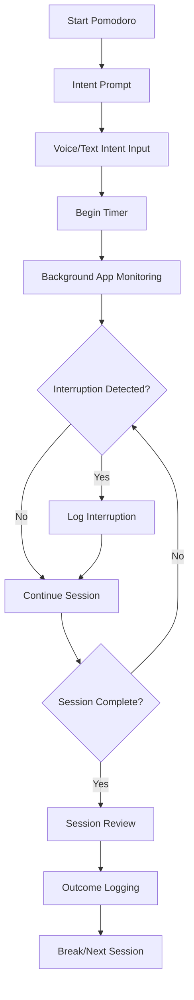

**UI Flow During Work Session:**

1. **Intent Setting**
   ```
   ┌─────────────────────────────────────┐
   │ Starting 25-minute focus block      │
   │                                     │
   │ What's your intent for this time?   │
   │ ┌─────────────────────────────────┐ │
   │ │ "Finish slide deck for client   │ │
   │ │  presentation, focus on story   │ │
   │ │  flow and key metrics"          │ │
   │ └─────────────────────────────────┘ │
   │                                     │
   │ [🎤 Voice] [⌨️ Type] [🚀 Start]    │
   └─────────────────────────────────────┘
   ```

2. **Active Session Display**
   ```
   ┌─────────────────────────────────────┐
   │ 🍅 Focus Session Active             │
   │                                     │
   │     ⏱️  18:32 remaining             │
   │     📝  Presentation prep           │
   │     📱  Current: PowerPoint         │
   │     🎯  Deep Work mode              │
   │                                     │
   │ Interruptions: 1  Focus: 94%       │
   │                                     │
   │ [⏸️ Pause] [⏹️ Stop] [➕ Time]     │
   └─────────────────────────────────────┘
   ```

3. **Interruption Handling**
   ```
   ┌─────────────────────────────────────┐
   │ ⚠️  Distraction Detected            │
   │                                     │
   │ You switched to Slack (2min ago)   │
   │                                     │
   │ [📝 Log as Work] [🚫 Mark Distraction] │
   │ [💬 Quick Response] [🔄 Resume Focus] │
   └─────────────────────────────────────┘
   ```

4. **Session Completion**
   ```
   ┌─────────────────────────────────────┐
   │ 🎉 Session Complete!                │
   │                                     │
   │ Intent: Presentation prep           │
   │ Outcome: ________________________   │
   │                                     │
   │ How did it go?                      │
   │ 😔 😐 😊 😍 (Rate your focus)      │
   │                                     │
   │ [📝 Add Notes] [☕ Take Break]     │
   └─────────────────────────────────────┘
   ```

---

### 3. AI Planning & Adjustment Journey

#### **Scenario:** Mid-day schedule disruption requiring AI replanning

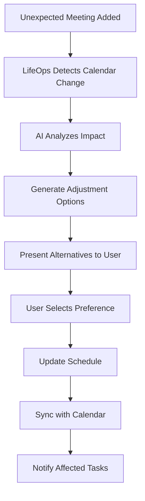

**UI Flow for Schedule Adjustment:**

1. **Disruption Notification**
   ```
   ┌─────────────────────────────────────┐
   │ 🔄 Schedule Change Detected         │
   │                                     │
   │ New meeting: "Client Call"          │
   │ Time: 2:30-3:30pm (conflicts with  │
   │       your design review block)     │
   │                                     │
   │ Let me help you adjust...           │
   │                                     │
   │ [🤖 Auto-adjust] [✏️ Manual]       │
   └─────────────────────────────────────┘
   ```

2. **AI Suggestions**
   ```
   ┌─────────────────────────────────────┐
   │ 🧠 Smart Adjustments                │
   │                                     │
   │ Option 1: Move design review to     │
   │          4:00pm (post-meeting)      │
   │          Impact: 15min delay        │
   │                                     │
   │ Option 2: Split review into 2 parts│
   │          Now: 30min, Later: 30min  │
   │          Impact: Context switching  │
   │                                     │
   │ Option 3: Reschedule to tomorrow   │
   │          Impact: 1-day delay        │
   │                                     │
   │ [1] [2] [3] [🎤 Explain preference]│
   └─────────────────────────────────────┘
   ```

3. **Confirmation & Update**
   ```
   ┌─────────────────────────────────────┐
   │ ✅ Schedule Updated                 │
   │                                     │
   │ • Client call: 2:30-3:30pm         │
   │ • Design review: 4:00-5:00pm       │
   │ • Added 10min buffer for transition│
   │                                     │
   │ Updated calendar & notified team    │
   │                                     │
   │ [📅 View New Plan] [🚀 Continue]   │
   └─────────────────────────────────────┘
   ```

---

### 4. Evening Reflection Journey

#### **Scenario:** End-of-day review and planning for tomorrow

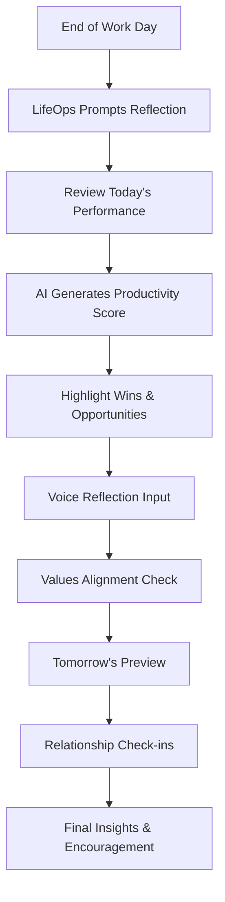

**UI Flow for Evening Reflection:**

1. **Reflection Prompt**
   ```
   ┌─────────────────────────────────────┐
   │ 🌅 Day Complete - Time to Reflect   │
   │                                     │
   │ You accomplished a lot today!       │
   │                                     │
   │ • 4/5 Pomodoros completed          │
   │ • 6.2 hours of focused work        │
   │ • 2 big tasks finished             │
   │                                     │
   │ [📊 See Full Report] [🎤 Reflect]  │
   └─────────────────────────────────────┘
   ```

2. **Productivity Score**
   ```
   ┌─────────────────────────────────────┐
   │ 📈 Today's Productivity Score: 87/100│
   │                                     │
   │ ┌─────────────────────────────────┐ │
   │ │ Focus Time:      92/100 ████▓   │ │
   │ │ Task Completion: 85/100 ████▒   │ │
   │ │ Intent Alignment:89/100 ████▒   │ │
   │ │ Life Balance:    82/100 ████░   │ │
   │ └─────────────────────────────────┘ │
   │                                     │
   │ 🏆 Personal best this week!         │
   │                                     │
   │ [📝 See Insights] [🔍 Details]     │
   └─────────────────────────────────────┘
   ```

3. **AI Insights & Feedback**
   ```
   ┌─────────────────────────────────────┐
   │ 🧠 Today's Insights                 │
   │                                     │
   │ 🎯 Top Wins:                        │
   │ • Stayed focused during morning     │
   │ • Handled interruptions well       │
   │ • Completed presentation on time   │
   │                                     │
   │ 🔍 Growth Opportunities:            │
   │ • Long email session (45min)       │
   │ • Skipped afternoon break          │
   │                                     │
   │ 💡 Tomorrow's Suggestion:           │
   │ • Block email time to 20min chunks │
   │                                     │
   │ [🎤 Add Thoughts] [👍 Looks Good]  │
   └─────────────────────────────────────┘
   ```

4. **Values Alignment Check**
   ```
   ┌─────────────────────────────────────┐
   │ 💎 Living Your Values               │
   │                                     │
   │ Did you live your core values today?│
   │                                     │
   │ Growth    ████████░░ 8/10           │
   │ Integrity ██████████ 10/10          │
   │ Balance   ██████░░░░ 6/10           │
   │                                     │
   │ 🎤 "I pushed myself to learn new    │
   │    design techniques, but missed    │
   │    lunch with Sarah. Tomorrow I'll  │
   │    protect relationship time."      │
   │                                     │
   │ [💾 Save Reflection] [📅 Tomorrow] │
   └─────────────────────────────────────┘
   ```

5. **Tomorrow's Preview**
   ```
   ┌─────────────────────────────────────┐
   │ 🌅 Tomorrow's Opportunities         │
   │                                     │
   │ Based on your patterns and calendar:│
   │                                     │
   │ • Start with creative work (9-11am) │
   │ • Team meeting at 11am             │
   │ • Protect lunch break (12-1pm)     │
   │ • Code review in afternoon          │
   │                                     │
   │ 📱 Relationship Reminder:           │
   │ • Text Sarah about lunch plans     │
   │ • Check in with Mom (haven't       │
   │   talked in 5 days)                │
   │                                     │
   │ [✨ Set Tomorrow's Intent] [😴 Rest]│
   └─────────────────────────────────────┘
   ```

---

## 🔄 Data Flow Architecture

### Core Data Processing Pipeline

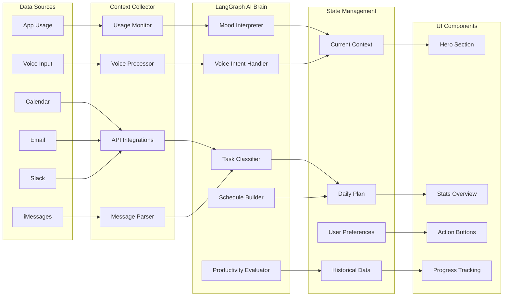

### Real-Time Context Updates

```typescript
interface ContextUpdate {
  timestamp: Date;
  source: 'app-usage' | 'voice' | 'calendar' | 'manual';
  data: {
    currentActivity?: AppActivity;
    moodUpdate?: MoodEntry;
    taskProgress?: TaskUpdate;
    scheduleChange?: ScheduleModification;
  };
  aiProcessing: {
    triggerNodes: LangGraphNode[];
    updateUI: UIComponent[];
    notifications?: Notification[];
  };
}
```

---

## 🎤 Voice Interaction Flows

### Natural Language Processing Pipeline

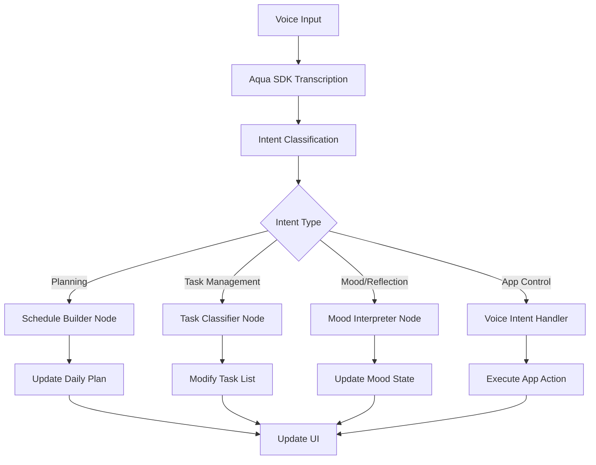

### Voice Command Examples

#### **Planning Commands**
```
User: "I'm feeling overwhelmed, can you lighten my schedule?"
AI: "I'll move 2 non-urgent tasks to tomorrow and add 15-minute breaks between meetings."

User: "Add 30 minutes for lunch prep to my calendar"
AI: "Added 'Lunch prep' from 11:30-12:00. Moved your 12pm call to 12:15."

User: "I want to focus on creative work this morning"
AI: "Perfect! I'll block 9-11am for deep creative work and move admin tasks to afternoon."
```

#### **Task Management Commands**
```
User: "Create a task to review the marketing proposal Sarah sent"
AI: "Added 'Review marketing proposal from Sarah' as a medium task. Should I schedule it for this afternoon?"

User: "Mark the presentation as complete"
AI: "Great job! Presentation marked complete. You finished 30 minutes ahead of schedule."

User: "What should I work on next?"
AI: "Based on your energy level and schedule, I recommend the design review - it's a good medium-intensity task."
```

#### **Reflection & Mood Commands**
```
User: "I'm feeling distracted and can't focus"
AI: "I hear that. Let's try a 5-minute mindfulness break, then a shorter 15-minute focus block."

User: "Today was really productive, I feel great"
AI: "Wonderful! I'll note this high-energy pattern. You completed 4 deep work blocks - that's 25% above your average."

User: "I keep getting interrupted by Slack messages"
AI: "I'll suggest notification blocking during your next focus session. Should I help you set up Do Not Disturb?"
```

---

## 📱 UI State Management & Navigation

### State Architecture

```typescript
interface AppState {
  // Core context
  currentContext: {
    activeApp: string;
    currentTask?: Task;
    pomodoroSession?: PomodoroSession;
    mood: MoodEntry;
    energyLevel: number;
  };
  
  // Daily planning
  dailyPlan: {
    schedule: TimeBlock[];
    tasks: TaskStructure;
    goals: Goal[];
    adjustments: ScheduleChange[];
  };
  
  // User interface
  uiState: {
    activeView: 'hero' | 'analytics' | 'tasks' | 'settings';
    notifications: Notification[];
    loading: LoadingState;
    modals: ModalState;
  };
  
  // Historical data
  analytics: {
    productivityScores: ProductivityScore[];
    patterns: BehaviorPattern[];
    insights: AIInsight[];
  };
}
```

### Navigation Flow in Minimal Focus Layout

```
┌─────────────────────────────────────┐
│ 🏠 LifeOps                         │ ← Always visible header
├─────────────────────────────────────┤
│                                     │
│         HERO SECTION                │ ← Primary focus area
│     (Dynamic based on context)     │
│                                     │
├─────────────────────────────────────┤
│  📊 Stats  │  📋 Tasks  │  ⚙️ More  │ ← Quick navigation
└─────────────────────────────────────┘
```

### Context-Aware UI Updates

```typescript
interface UIUpdate {
  trigger: ContextChange;
  updates: {
    heroSection: {
      title: string;
      subtitle: string;
      primaryAction: Action;
      secondaryAction?: Action;
    };
    statsSection: {
      metrics: Metric[];
      trends: Trend[];
    };
    notifications: Notification[];
  };
}

// Example: Starting Pomodoro
const pomodoroStartUpdate: UIUpdate = {
  trigger: 'pomodoro-start',
  updates: {
    heroSection: {
      title: "🍅 Focus Session Active",
      subtitle: "18:32 remaining - Presentation prep",
      primaryAction: { label: "Pause", action: "pause-pomodoro" },
      secondaryAction: { label: "Stop", action: "stop-pomodoro" }
    },
    statsSection: {
      metrics: [
        { label: "Session", value: "1/4 today" },
        { label: "Focus", value: "94%" }
      ]
    }
  }
};
```

---

## 🔄 Integration Workflows

### Email → Task Extraction Flow

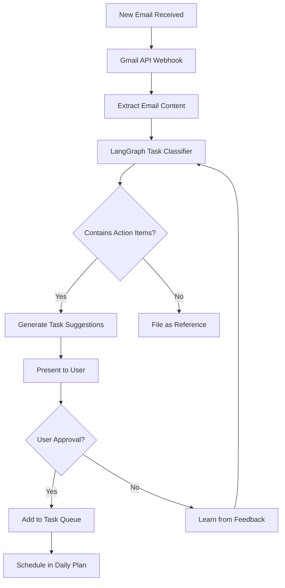

### Calendar Sync & Conflict Resolution

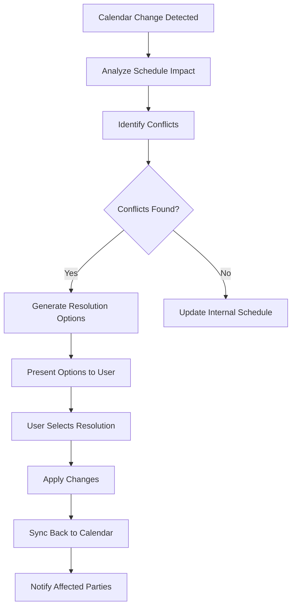

### iMessage Context Integration

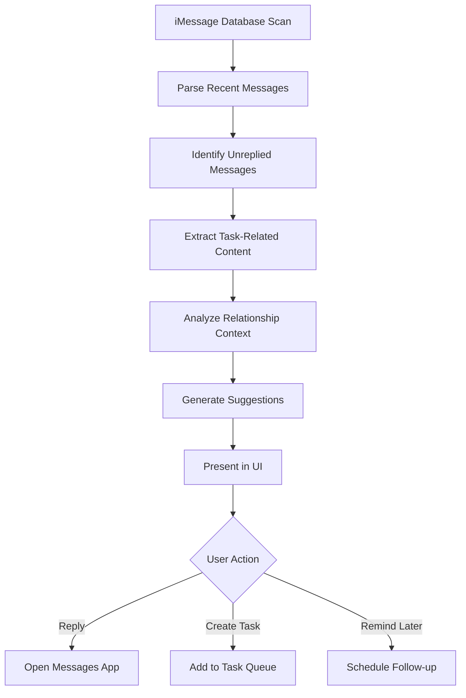

---

## 🎯 User Onboarding Flow

### First-Time Setup Journey

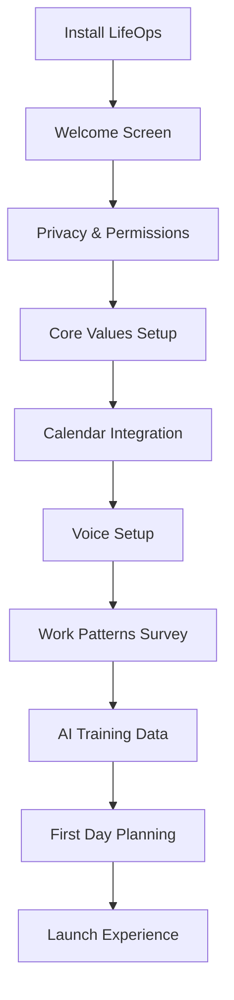

### Onboarding UI Screens

#### 1. Welcome & Value Proposition
```
┌─────────────────────────────────────┐
│ 🌟 Welcome to LifeOps              │
│                                     │
│ Your AI-powered personal operating  │
│ system for intentional living       │
│                                     │
│ LifeOps helps you:                 │
│ • Plan optimal days based on mood  │
│ • Track focus and productivity     │
│ • Balance work and relationships   │
│ • Live aligned with your values    │
│                                     │
│ [🚀 Get Started] [📖 Learn More]   │
└─────────────────────────────────────┘
```

#### 2. Privacy First
```
┌─────────────────────────────────────┐
│ 🔒 Your Privacy Matters             │
│                                     │
│ LifeOps processes your data locally │
│ whenever possible. We'll ask for    │
│ permission before accessing:        │
│                                     │
│ ✓ App usage (for focus tracking)   │
│ ✓ Calendar (for smart planning)    │
│ ✓ Voice input (for AI assistance)  │
│ ✓ Messages (for task extraction)   │
│                                     │
│ You control what data is shared and │
│ can revoke access anytime.          │
│                                     │
│ [🛡️ Review Settings] [✅ Continue]  │
└─────────────────────────────────────┘
```

#### 3. Core Values Definition
```
┌─────────────────────────────────────┐
│ 💎 What Matters Most to You?        │
│                                     │
│ Select your top 3 core values:     │
│                                     │
│ □ Growth & Learning                 │
│ □ Health & Wellness                │
│ □ Relationships & Love             │
│ ☑ Creativity & Expression           │
│ ☑ Achievement & Success             │
│ □ Peace & Balance                  │
│ ☑ Integrity & Authenticity         │
│ □ Adventure & Freedom              │
│ □ Service & Impact                 │
│                                     │
│ LifeOps will help you live these   │
│ values through daily tracking.     │
│                                     │
│ [⚡ Add Custom Value] [➡️ Next]     │
└─────────────────────────────────────┘
```

#### 4. Work Patterns Survey
```
┌─────────────────────────────────────┐
│ 🧠 Tell Us About Your Work Style    │
│                                     │
│ When do you do your best work?     │
│ ○ Early morning (6-9am)            │
│ ● Mid morning (9am-12pm)           │
│ ○ Afternoon (12-5pm)               │
│ ○ Evening (5-9pm)                  │
│                                     │
│ How long can you focus deeply?     │
│ ○ 15-25 minutes                    │
│ ● 25-45 minutes                    │
│ ○ 45-90 minutes                    │
│ ○ 90+ minutes                      │
│                                     │
│ Biggest productivity challenge?    │
│ ○ Getting started                  │
│ ● Staying focused                  │
│ ○ Prioritizing tasks               │
│ ○ Work-life balance                │
│                                     │
│ [🎯 Customize Further] [🚀 Start!] │
└─────────────────────────────────────┘
```

---

## 📊 Advanced Features Integration

### Ghost Mode - Shadow Learning

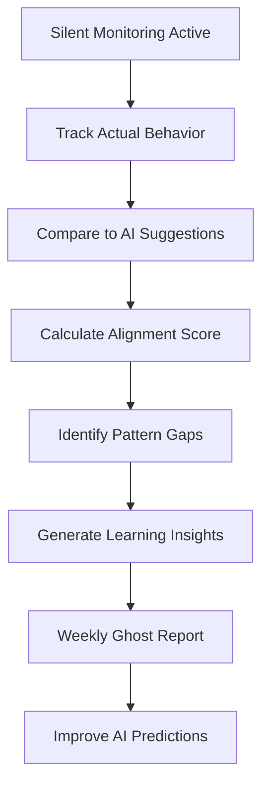

### Weekly Executive Summary Flow

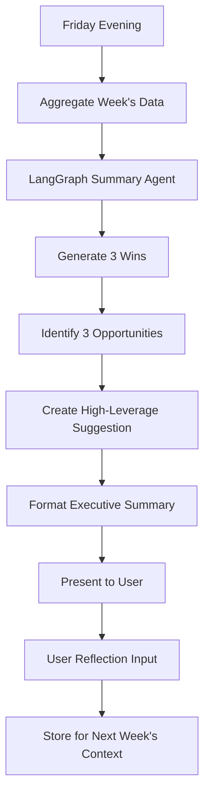

### Connection Tracker Workflow

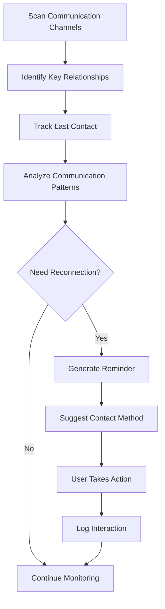

---

## 🚀 Performance & Optimization

### Lazy Loading Strategy
```typescript
interface LazyLoadConfig {
  components: {
    analytics: () => import('./AnalyticsDashboard');
    settings: () => import('./SettingsPanel');
    reports: () => import('./ReportsView');
  };
  data: {
    historicalAnalytics: 'on-demand';
    detailedReports: 'user-triggered';
    backgroundSync: 'intelligent-batching';
  };
}
```

### Background Processing
```typescript
interface BackgroundTasks {
  continuous: {
    appUsageMonitoring: PerformanceLevel.Low;
    voiceListening: PerformanceLevel.Minimal;
  };
  periodic: {
    emailSync: '15-minutes';
    calendarSync: '5-minutes';
    messageSync: '30-minutes';
    aiProcessing: 'user-idle-time';
  };
  triggered: {
    scheduleGeneration: 'user-request';
    taskClassification: 'new-data-available';
    productivityScoring: 'end-of-day';
  };
}
```

---

## 📱 Mobile Companion Considerations

While LifeOps is primarily a macOS desktop app, consider future mobile integration:

### Mobile Features Subset
```typescript
interface MobileFeatures {
  core: {
    quickTaskCapture: VoiceNote;
    pomodoroTimer: SimpleTimer;
    moodLogging: QuickInput;
    scheduleView: ReadOnly;
  };
  sync: {
    dataSync: BidirectionalSync;
    contextHandoff: DesktopToMobile;
    notifications: CrossPlatform;
  };
}
```

---

This comprehensive app flow documentation provides the foundation for implementing LifeOps as a seamless, AI-powered personal operating system that respects user privacy while delivering intelligent assistance for intentional living and peak productivity.