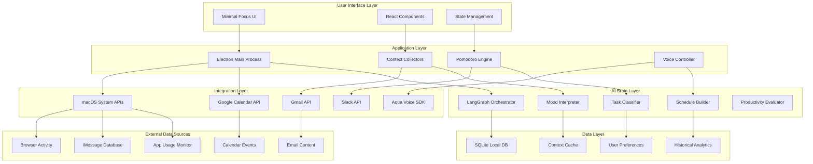
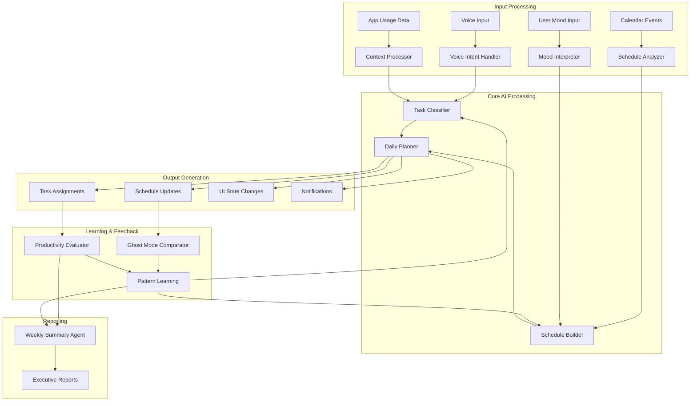

# 🏗️ LifeOps Technical Architecture

> **Comprehensive system design and implementation guide for the AI-powered personal operating system**

---

## 🎯 Architecture Overview

LifeOps is built as a modular, privacy-first macOS desktop application that combines real-time context monitoring, AI-powered planning, and intuitive user experience through the Minimal Focus UI paradigm.

### Core Principles
- **Privacy First**: Local processing whenever possible
- **Modular Design**: Independent, testable components
- **AI-Enhanced**: LangGraph for intelligent decision making
- **Performance Optimized**: Minimal system impact
- **User-Centric**: Clean, action-oriented interface

---

## 🏛️ System Architecture Diagram



---

## 🧠 LangGraph AI Brain Architecture

### Node Definitions & Relationships

```typescript
interface LangGraphNode {
  id: string;
  name: string;
  inputs: InputSchema;
  outputs: OutputSchema;
  dependencies: string[];
  processingFunction: (input: any) => Promise<any>;
}

interface LifeOpsGraph {
  nodes: {
    moodInterpreter: MoodInterpreterNode;
    taskClassifier: TaskClassifierNode;
    scheduleBuilder: ScheduleBuilderNode;
    voiceIntentHandler: VoiceIntentHandlerNode;
    productivityEvaluator: ProductivityEvaluatorNode;
    ghostModeComparator: GhostModeComparatorNode;
    weeklySummaryAgent: WeeklySummaryAgentNode;
    scheduleModifier: ScheduleModifierNode;
  };
  edges: GraphEdge[];
  state: GraphState;
}
```

### LangGraph Flow Diagram



### Individual Node Specifications

#### 1. Mood Interpreter Node
```typescript
interface MoodInterpreterNode extends LangGraphNode {
  inputs: {
    voiceAudio?: AudioBuffer;
    textInput?: string;
    contextualData: {
      timeOfDay: Date;
      recentActivity: AppUsageData[];
      calendarPressure: number;
    };
  };
  
  outputs: {
    mood: {
      valence: number; // -1 to 1 (negative to positive)
      arousal: number; // 0 to 1 (calm to energetic)
      confidence: number; // 0 to 1
    };
    energy: {
      level: number; // 0 to 10
      sustainability: number; // predicted duration
    };
    recommendations: {
      taskIntensity: 'low' | 'medium' | 'high';
      breakFrequency: number; // minutes
      socialInteraction: 'avoid' | 'neutral' | 'seek';
    };
  };

  processingFunction: async (input) => {
    const voiceSentiment = await analyzeVoiceSentiment(input.voiceAudio);
    const textSentiment = await analyzeTextSentiment(input.textInput);
    const contextualMood = inferMoodFromContext(input.contextualData);
    
    return {
      mood: combineSentimentData(voiceSentiment, textSentiment, contextualMood),
      energy: calculateEnergyLevel(input),
      recommendations: generateMoodBasedRecommendations(mood, energy)
    };
  };
}
```

#### 2. Task Classifier Node
```typescript
interface TaskClassifierNode extends LangGraphNode {
  inputs: {
    emailContent: EmailData[];
    slackMessages: SlackMessage[];
    voiceNotes: VoiceNote[];
    manualTasks: ManualTask[];
    iMessages: MessageData[];
    existingTasks: Task[];
  };

  outputs: {
    taskStructure: {
      big: Task[];     // 1 major task
      medium: Task[];  // 3 medium tasks
      small: Task[];   // 5 small tasks
    };
    confidence: number;
    reasoning: string;
    suggestions: TaskSuggestion[];
  };

  processingFunction: async (input) => {
    const extractedTasks = await Promise.all([
      extractTasksFromEmail(input.emailContent),
      extractTasksFromSlack(input.slackMessages),
      parseVoiceNotes(input.voiceNotes),
      processManualTasks(input.manualTasks),
      analyzeMessages(input.iMessages)
    ]);

    const allTasks = flattenAndDeduplicateTasks(extractedTasks);
    const classifiedTasks = await classifyTasksByPriority(allTasks);
    const optimizedStructure = optimizeTaskStructure(classifiedTasks);

    return {
      taskStructure: optimizedStructure,
      confidence: calculateClassificationConfidence(allTasks),
      reasoning: generateReasoningExplanation(classifiedTasks),
      suggestions: generateTaskSuggestions(optimizedStructure)
    };
  };
}
```

#### 3. Schedule Builder Node
```typescript
interface ScheduleBuilderNode extends LangGraphNode {
  inputs: {
    taskStructure: TaskStructure;
    calendarEvents: CalendarEvent[];
    mood: MoodData;
    energy: EnergyData;
    userPreferences: UserPreferences;
    historicalPatterns: HistoricalData;
  };

  outputs: {
    dailySchedule: {
      timeBlocks: TimeBlock[];
      pomodoroSessions: PomodoroSession[];
      breaks: Break[];
      bufferTime: BufferTime[];
    };
    optimization: {
      score: number;
      reasoning: string;
      alternatives: AlternativeSchedule[];
    };
  };

  processingFunction: async (input) => {
    const energyProfile = buildEnergyProfile(input.mood, input.energy, input.historicalPatterns);
    const taskScheduling = optimizeTaskPlacement(input.taskStructure, energyProfile);
    const calendarIntegration = resolveCalendarConflicts(taskScheduling, input.calendarEvents);
    const pomodoroPlanning = generatePomodoroSessions(calendarIntegration);

    return {
      dailySchedule: {
        timeBlocks: calendarIntegration.timeBlocks,
        pomodoroSessions: pomodoroPlanning.sessions,
        breaks: calculateOptimalBreaks(pomodoroPlanning),
        bufferTime: insertBufferTime(calendarIntegration)
      },
      optimization: {
        score: calculateScheduleScore(dailySchedule),
        reasoning: explainScheduleDecisions(dailySchedule),
        alternatives: generateAlternativeSchedules(input)
      }
    };
  };
}
```

#### 4. Voice Intent Handler Node
```typescript
interface VoiceIntentHandlerNode extends LangGraphNode {
  inputs: {
    audioBuffer: AudioBuffer;
    transcription: string;
    currentContext: AppContext;
    conversationHistory: ConversationTurn[];
  };

  outputs: {
    intent: {
      type: 'planning' | 'task_management' | 'mood_reflection' | 'app_control' | 'question';
      confidence: number;
      parameters: Record<string, any>;
    };
    response: {
      text: string;
      actions: Action[];
      followUpQuestions?: string[];
    };
    contextUpdate: Partial<AppContext>;
  };

  processingFunction: async (input) => {
    const intent = await classifyVoiceIntent(input.transcription, input.currentContext);
    const parameters = extractIntentParameters(input.transcription, intent);
    const response = await generateContextualResponse(intent, parameters, input.currentContext);
    const actions = determineRequiredActions(intent, parameters);
    const contextUpdates = calculateContextChanges(intent, parameters);

    return {
      intent: { type: intent, confidence: intent.confidence, parameters },
      response: { text: response, actions, followUpQuestions: generateFollowUps(intent) },
      contextUpdate: contextUpdates
    };
  };
}
```

#### 5. Productivity Evaluator Node
```typescript
interface ProductivityEvaluatorNode extends LangGraphNode {
  inputs: {
    dailyActivity: AppUsageData[];
    completedTasks: Task[];
    pomodoroSessions: CompletedPomodoroSession[];
    moodEntries: MoodEntry[];
    plannedVsActual: ScheduleComparison;
  };

  outputs: {
    productivityScore: {
      overall: number; // 0-100
      categories: {
        focusTime: number;
        taskCompletion: number;
        intentAlignment: number;
        lifeBalance: number;
      };
    };
    insights: {
      wins: string[];
      opportunities: string[];
      patterns: BehaviorPattern[];
      suggestions: string[];
    };
    coaching: {
      tone: 'encouraging' | 'motivating' | 'supportive' | 'challenging';
      message: string;
      actionableAdvice: string[];
    };
  };

  processingFunction: async (input) => {
    const focusScore = calculateFocusScore(input.dailyActivity, input.pomodoroSessions);
    const completionScore = calculateTaskCompletionScore(input.completedTasks);
    const alignmentScore = calculateIntentAlignmentScore(input.plannedVsActual);
    const balanceScore = calculateLifeBalanceScore(input.dailyActivity, input.moodEntries);

    const overallScore = weightedAverage([focusScore, completionScore, alignmentScore, balanceScore]);
    const insights = generateInsights(input, { focusScore, completionScore, alignmentScore, balanceScore });
    const coaching = generateCoachingMessage(overallScore, insights);

    return {
      productivityScore: {
        overall: overallScore,
        categories: { focusTime: focusScore, taskCompletion: completionScore, intentAlignment: alignmentScore, lifeBalance: balanceScore }
      },
      insights,
      coaching
    };
  };
}
```

---

## 💾 Database Schema Design

### SQLite Schema

```sql
-- Core user context and settings
CREATE TABLE user_profile (
    id INTEGER PRIMARY KEY,
    created_at TIMESTAMP DEFAULT CURRENT_TIMESTAMP,
    core_values TEXT, -- JSON array
    work_preferences TEXT, -- JSON object
    notification_settings TEXT, -- JSON object
    privacy_settings TEXT -- JSON object
);

-- App usage tracking
CREATE TABLE app_usage (
    id INTEGER PRIMARY KEY,
    timestamp TIMESTAMP DEFAULT CURRENT_TIMESTAMP,
    app_name TEXT NOT NULL,
    window_title TEXT,
    url TEXT, -- for browser apps
    duration_seconds INTEGER,
    category TEXT, -- 'deep-work', 'admin', 'distraction', 'social', 'errands'
    classification_confidence REAL,
    user_override BOOLEAN DEFAULT FALSE
);

-- Pomodoro sessions
CREATE TABLE pomodoro_sessions (
    id INTEGER PRIMARY KEY,
    start_time TIMESTAMP NOT NULL,
    end_time TIMESTAMP,
    planned_duration INTEGER, -- minutes
    actual_duration INTEGER, -- minutes
    intent TEXT NOT NULL,
    outcome TEXT,
    interruptions INTEGER DEFAULT 0,
    focus_rating INTEGER, -- 1-10 user rating
    status TEXT, -- 'completed', 'abandoned', 'interrupted'
    related_task_id INTEGER,
    FOREIGN KEY (related_task_id) REFERENCES tasks(id)
);

-- Task management
CREATE TABLE tasks (
    id INTEGER PRIMARY KEY,
    created_at TIMESTAMP DEFAULT CURRENT_TIMESTAMP,
    updated_at TIMESTAMP DEFAULT CURRENT_TIMESTAMP,
    title TEXT NOT NULL,
    description TEXT,
    priority TEXT, -- 'big', 'medium', 'small'
    source TEXT, -- 'gmail', 'slack', 'voice', 'manual', 'imessage'
    source_reference TEXT, -- email ID, message ID, etc.
    estimated_duration INTEGER, -- minutes
    scheduled_time TIMESTAMP,
    completed_at TIMESTAMP,
    completion_rating INTEGER, -- 1-10 satisfaction rating
    ai_generated BOOLEAN DEFAULT FALSE,
    user_confirmed BOOLEAN DEFAULT TRUE
);

-- Mood and energy tracking
CREATE TABLE mood_entries (
    id INTEGER PRIMARY KEY,
    timestamp TIMESTAMP DEFAULT CURRENT_TIMESTAMP,
    valence REAL, -- -1 to 1
    arousal REAL, -- 0 to 1
    energy_level INTEGER, -- 0 to 10
    source TEXT, -- 'voice', 'manual', 'inferred'
    notes TEXT,
    context_data TEXT -- JSON with current activity, etc.
);

-- Daily plans and schedules
CREATE TABLE daily_plans (
    id INTEGER PRIMARY KEY,
    date DATE NOT NULL UNIQUE,
    created_at TIMESTAMP DEFAULT CURRENT_TIMESTAMP,
    schedule_data TEXT, -- JSON with complete schedule
    mood_context TEXT, -- JSON with mood data
    task_context TEXT, -- JSON with task assignments
    optimization_score REAL,
    user_modifications TEXT, -- JSON with user changes
    actual_adherence REAL -- calculated at end of day
);

-- Productivity scores and analytics
CREATE TABLE productivity_scores (
    id INTEGER PRIMARY KEY,
    date DATE NOT NULL,
    overall_score INTEGER, -- 0-100
    focus_score INTEGER,
    completion_score INTEGER,
    alignment_score INTEGER,
    balance_score INTEGER,
    insights TEXT, -- JSON with wins, opportunities, patterns
    coaching_message TEXT,
    user_reflection TEXT
);

-- Voice interactions and transcriptions
CREATE TABLE voice_interactions (
    id INTEGER PRIMARY KEY,
    timestamp TIMESTAMP DEFAULT CURRENT_TIMESTAMP,
    transcription TEXT NOT NULL,
    intent_type TEXT,
    intent_confidence REAL,
    response_text TEXT,
    actions_taken TEXT, -- JSON array
    context_before TEXT, -- JSON snapshot
    context_after TEXT, -- JSON snapshot
    user_satisfaction INTEGER -- 1-5 rating
);

-- External integrations and sync state
CREATE TABLE integration_sync (
    id INTEGER PRIMARY KEY,
    service_name TEXT NOT NULL, -- 'gmail', 'calendar', 'slack'
    last_sync TIMESTAMP,
    sync_status TEXT, -- 'success', 'error', 'partial'
    error_message TEXT,
    items_processed INTEGER,
    next_sync TIMESTAMP
);

-- Connection and relationship tracking
CREATE TABLE connections (
    id INTEGER PRIMARY KEY,
    contact_identifier TEXT NOT NULL, -- email, phone, slack ID
    contact_name TEXT,
    relationship_type TEXT, -- 'family', 'friend', 'colleague', 'client'
    last_interaction TIMESTAMP,
    interaction_frequency INTEGER, -- days between typical interactions
    importance_score INTEGER, -- 1-10
    notes TEXT
);

-- Ghost mode tracking (plan vs reality)
CREATE TABLE ghost_mode_data (
    id INTEGER PRIMARY KEY,
    date DATE NOT NULL,
    planned_schedule TEXT, -- JSON
    actual_behavior TEXT, -- JSON
    alignment_score REAL,
    gap_analysis TEXT, -- JSON
    learning_insights TEXT, -- JSON
    schedule_adjustments TEXT -- JSON for next iteration
);

-- Indexes for performance
CREATE INDEX idx_app_usage_timestamp ON app_usage(timestamp);
CREATE INDEX idx_app_usage_category ON app_usage(category);
CREATE INDEX idx_tasks_priority ON tasks(priority);
CREATE INDEX idx_tasks_scheduled_time ON tasks(scheduled_time);
CREATE INDEX idx_mood_entries_timestamp ON mood_entries(timestamp);
CREATE INDEX idx_daily_plans_date ON daily_plans(date);
CREATE INDEX idx_productivity_scores_date ON productivity_scores(date);
CREATE INDEX idx_voice_interactions_timestamp ON voice_interactions(timestamp);
```

---

## 🔌 Integration Architecture

### macOS System Integrations

#### App Usage Monitoring
```typescript
interface AppUsageMonitor {
  implementation: 'active-win' | 'accessibility-api';
  pollingInterval: number; // milliseconds
  
  async getCurrentApp(): Promise<AppInfo> {
    const activeWindow = await activeWin();
    return {
      appName: activeWindow.owner.name,
      windowTitle: activeWindow.title,
      bundleId: activeWindow.owner.bundleId,
      timestamp: new Date()
    };
  }

  async startMonitoring(): Promise<void> {
    setInterval(async () => {
      const appInfo = await this.getCurrentApp();
      await this.processAppUsage(appInfo);
    }, this.pollingInterval);
  }

  private async processAppUsage(appInfo: AppInfo): Promise<void> {
    const category = await this.classifyAppCategory(appInfo);
    await this.storeUsageData(appInfo, category);
    await this.updateUIIfNeeded(appInfo);
  }
}
```

#### Browser Activity Extraction
```typescript
interface BrowserMonitor {
  supportedBrowsers: ['Safari', 'Chrome', 'Firefox', 'Edge'];
  
  async extractCurrentTab(): Promise<TabInfo> {
    const script = `
      tell application "Safari"
        return {URL of current tab of front window, name of current tab of front window}
      end tell
    `;
    
    const result = await runAppleScript(script);
    return {
      url: result[0],
      title: result[1],
      timestamp: new Date()
    };
  }

  async classifyWebActivity(tabInfo: TabInfo): Promise<ActivityCategory> {
    const domain = new URL(tabInfo.url).hostname;
    const classification = await this.aiClassifier.classifyURL(domain, tabInfo.title);
    return classification;
  }
}
```

#### iMessage Database Access
```typescript
interface iMessageReader {
  databasePath: '~/Library/Messages/chat.db';
  
  async readRecentMessages(hours: number = 24): Promise<Message[]> {
    const db = await sqlite3.open(this.databasePath);
    const query = `
      SELECT 
        message.ROWID,
        message.text,
        message.date,
        message.is_from_me,
        handle.id as contact
      FROM message
      LEFT JOIN handle ON message.handle_id = handle.ROWID
      WHERE message.date > (strftime('%s', 'now') - ?) * 1000000000
      ORDER BY message.date DESC
    `;
    
    const messages = await db.all(query, [hours * 3600]);
    return messages.map(this.formatMessage);
  }

  async detectUnrepliedMessages(): Promise<UnrepliedMessage[]> {
    const messages = await this.readRecentMessages(48);
    const conversations = this.groupByContact(messages);
    
    return conversations
      .filter(conv => this.isAwaitingReply(conv))
      .map(conv => ({
        contact: conv.contact,
        lastMessage: conv.messages[0],
        timeSinceLastReply: this.calculateTimeSince(conv.lastIncoming)
      }));
  }
}
```

### External API Integrations

#### Google Calendar Integration
```typescript
interface GoogleCalendarService {
  private oauth2Client: OAuth2Client;
  
  async syncCalendar(): Promise<CalendarEvent[]> {
    const calendar = google.calendar({ version: 'v3', auth: this.oauth2Client });
    
    const response = await calendar.events.list({
      calendarId: 'primary',
      timeMin: new Date().toISOString(),
      timeMax: new Date(Date.now() + 7 * 24 * 60 * 60 * 1000).toISOString(),
      singleEvents: true,
      orderBy: 'startTime'
    });

    return response.data.items?.map(this.formatCalendarEvent) || [];
  }

  async createEvent(event: LifeOpsEvent): Promise<string> {
    const calendar = google.calendar({ version: 'v3', auth: this.oauth2Client });
    
    const response = await calendar.events.insert({
      calendarId: 'primary',
      requestBody: {
        summary: event.title,
        description: event.description,
        start: { dateTime: event.startTime.toISOString() },
        end: { dateTime: event.endTime.toISOString() },
        source: { title: 'LifeOps', url: 'lifeops://generated-event' }
      }
    });

    return response.data.id!;
  }
}
```

#### Gmail Integration
```typescript
interface GmailService {
  private auth: OAuth2Client;
  
  async extractTasks(hours: number = 24): Promise<ExtractedTask[]> {
    const gmail = google.gmail({ version: 'v1', auth: this.auth });
    
    const response = await gmail.users.messages.list({
      userId: 'me',
      q: `is:unread newer_than:${hours}h`,
      maxResults: 50
    });

    const tasks: ExtractedTask[] = [];
    
    for (const message of response.data.messages || []) {
      const fullMessage = await gmail.users.messages.get({
        userId: 'me',
        id: message.id!
      });
      
      const extractedTasks = await this.aiExtractTasks(fullMessage.data);
      tasks.push(...extractedTasks);
    }

    return tasks;
  }

  private async aiExtractTasks(email: gmail_v1.Schema$Message): Promise<ExtractedTask[]> {
    const content = this.extractEmailContent(email);
    const langGraphResponse = await this.taskClassifier.extractTasks({
      content,
      sender: this.extractSender(email),
      subject: this.extractSubject(email),
      timestamp: new Date(parseInt(email.internalDate!))
    });

    return langGraphResponse.tasks;
  }
}
```

#### Aqua Voice SDK Integration
```typescript
interface AquaVoiceService {
  private aquaClient: AquaClient;
  
  async startListening(): Promise<void> {
    await this.aquaClient.startContinuousListening({
      onTranscription: this.handleTranscription.bind(this),
      onError: this.handleVoiceError.bind(this),
      language: 'en-US',
      enableSentimentAnalysis: true
    });
  }

  private async handleTranscription(result: TranscriptionResult): Promise<void> {
    const voiceIntent = await this.processVoiceInput({
      transcription: result.text,
      confidence: result.confidence,
      sentiment: result.sentiment,
      timestamp: new Date()
    });

    await this.routeVoiceIntent(voiceIntent);
  }

  async processVoiceInput(input: VoiceInput): Promise<VoiceIntent> {
    const langGraphResponse = await this.voiceIntentHandler.process({
      audioBuffer: input.audioBuffer,
      transcription: input.transcription,
      currentContext: await this.getCurrentContext(),
      conversationHistory: await this.getRecentConversations()
    });

    return langGraphResponse.intent;
  }
}
```

---

## 🔒 Security & Privacy Architecture

### Data Protection Strategy

```typescript
interface PrivacySettings {
  dataProcessing: {
    localOnly: string[];           // Data types that never leave device
    cloudProcessing: string[];     // Data types that can use cloud AI
    userControlled: string[];      // Data types requiring explicit consent
  };
  
  encryption: {
    atRest: EncryptionConfig;     // Local database encryption
    inTransit: TLSConfig;         // API communication encryption
    keys: KeyManagementConfig;    // Encryption key handling
  };
  
  retention: {
    rawData: number;              // Days to keep raw activity data
    aggregatedData: number;       // Days to keep processed insights
    voiceRecordings: number;      // Days to keep voice recordings
    deletionSchedule: CronConfig; // Automated cleanup schedule
  };
}

interface EncryptionConfig {
  algorithm: 'AES-256-GCM';
  keyDerivation: 'PBKDF2';
  saltLength: 32;
  iterations: 100000;
}
```

### Local-First Processing

```typescript
interface LocalProcessingPipeline {
  // Data that never leaves the device
  localOnly: {
    appUsageRaw: boolean;
    iMessageContent: boolean;
    voiceRecordings: boolean;
    personalNotes: boolean;
  };

  // Data processed locally with aggregated insights sent to cloud
  hybridProcessing: {
    taskClassification: {
      local: 'initial_extraction';
      cloud: 'ai_enhancement';
      privacy: 'anonymized_content';
    };
    
    moodAnalysis: {
      local: 'voice_sentiment';
      cloud: 'pattern_analysis';
      privacy: 'no_raw_audio';
    };
  };

  // Secure cloud processing for enhanced AI features
  cloudEnhanced: {
    scheduleOptimization: {
      dataMinimization: true;
      anonymization: true;
      encryptionInTransit: true;
    };
  };
}
```

### Permission Management

```typescript
interface PermissionManager {
  async requestPermissions(): Promise<PermissionStatus> {
    const permissions = {
      accessibility: await this.requestAccessibilityPermission(),
      calendar: await this.requestCalendarPermission(),
      microphone: await this.requestMicrophonePermission(),
      fullDiskAccess: await this.requestFullDiskAccessPermission()
    };

    return permissions;
  }

  private async requestAccessibilityPermission(): Promise<boolean> {
    // macOS Accessibility API for app monitoring
    return await this.systemPermissions.request('accessibility');
  }

  async revokePermission(type: PermissionType): Promise<void> {
    await this.systemPermissions.revoke(type);
    await this.disableRelatedFeatures(type);
    await this.notifyUserOfImpact(type);
  }
}
```

---

## ⚡ Performance & Optimization

### Resource Management

```typescript
interface PerformanceConfig {
  monitoring: {
    appUsagePolling: 5000;      // 5 seconds
    voiceProcessingBuffer: 2000; // 2 seconds
    aiProcessingQueue: true;     // Batch AI requests
    backgroundSyncInterval: 900000; // 15 minutes
  };

  optimization: {
    lazyLoading: ComponentLazyConfig;
    dataCompression: CompressionConfig;
    caching: CacheConfig;
    backgroundProcessing: BackgroundConfig;
  };

  limits: {
    maxMemoryUsage: '500MB';
    maxCPUUsage: '15%';
    maxDiskUsage: '2GB';
    maxNetworkRequests: 100; // per minute
  };
}

interface ComponentLazyConfig {
  routes: {
    analytics: () => import('./AnalyticsView');
    settings: () => import('./SettingsPanel');
    reports: () => import('./ReportsView');
  };
  
  features: {
    voiceProcessing: () => import('./VoiceEngine');
    aiProcessor: () => import('./AIProcessor');
    dataExport: () => import('./DataExporter');
  };
}
```

### Background Processing Strategy

```typescript
interface BackgroundProcessor {
  queues: {
    immediate: Queue<ImmediateTask>;    // UI updates, user feedback
    standard: Queue<StandardTask>;      // AI processing, data sync
    batch: Queue<BatchTask>;           // Analytics, cleanup
  };

  async processQueues(): Promise<void> {
    // Process immediate tasks first
    while (!this.queues.immediate.isEmpty()) {
      const task = this.queues.immediate.dequeue();
      await this.executeImmediately(task);
    }

    // Process standard tasks with rate limiting
    const standardTask = this.queues.standard.dequeue();
    if (standardTask && this.canProcessStandardTask()) {
      await this.executeWithRateLimit(standardTask);
    }

    // Process batch tasks during idle time
    if (this.isSystemIdle() && !this.queues.batch.isEmpty()) {
      const batchTask = this.queues.batch.dequeue();
      await this.executeBatchTask(batchTask);
    }
  }

  private isSystemIdle(): boolean {
    return this.cpuUsage < 10 && this.memoryUsage < 70;
  }
}
```

### Caching Strategy

```typescript
interface CacheManager {
  layers: {
    memory: MemoryCache;      // Hot data, 100MB limit
    disk: DiskCache;          // Warm data, 1GB limit
    persistent: PersistentCache; // Cold data, unlimited
  };

  policies: {
    appUsage: {
      memory: '1 hour',
      disk: '7 days',
      persistent: '90 days'
    };
    aiInsights: {
      memory: '24 hours',
      disk: '30 days',
      persistent: '1 year'
    };
    voiceTranscriptions: {
      memory: '10 minutes',
      disk: '3 days',
      persistent: '30 days'
    };
  };

  async get<T>(key: string, layer?: CacheLayer): Promise<T | null> {
    // Try memory first, then disk, then persistent
    for (const cache of [this.layers.memory, this.layers.disk, this.layers.persistent]) {
      const result = await cache.get<T>(key);
      if (result) {
        // Promote to higher cache level
        await this.promoteToHigherLevel(key, result);
        return result;
      }
    }
    return null;
  }
}
```

---

## 🧪 Testing Architecture

### Testing Strategy

```typescript
interface TestingFramework {
  unit: {
    framework: 'Jest';
    coverage: 90;
    components: [
      'LangGraph nodes',
      'Data processors',
      'UI components',
      'Utility functions'
    ];
  };

  integration: {
    framework: 'Jest + Testing Library';
    focus: [
      'AI workflow end-to-end',
      'Data synchronization',
      'Voice processing pipeline',
      'External API integrations'
    ];
  };

  e2e: {
    framework: 'Playwright';
    scenarios: [
      'User onboarding flow',
      'Daily planning workflow',
      'Pomodoro session management',
      'Voice command processing',
      'Data export functionality'
    ];
  };

  performance: {
    framework: 'Jest + Performance API';
    metrics: [
      'App startup time',
      'AI processing latency',
      'Memory usage patterns',
      'CPU usage during monitoring'
    ];
  };
}
```

### AI Testing Strategy

```typescript
interface AITestingFramework {
  nodeValidation: {
    moodInterpreter: {
      testCases: [
        { input: 'happy voice sample', expected: { valence: '>0.5' } },
        { input: 'stressed voice sample', expected: { arousal: '>0.7' } },
        { input: 'tired voice sample', expected: { energy: '<5' } }
      ];
    };

    taskClassifier: {
      testCases: [
        { input: 'email with deadline', expected: { priority: 'big' } },
        { input: 'routine request', expected: { priority: 'small' } },
        { input: 'meeting invitation', expected: { type: 'calendar_event' } }
      ];
    };
  };

  integrationTesting: {
    voiceToAction: {
      scenario: 'User says "schedule focus time for presentation"';
      expectedFlow: [
        'Voice transcription',
        'Intent classification',
        'Task creation',
        'Schedule insertion',
        'UI update'
      ];
    };

    planningWorkflow: {
      scenario: 'Morning planning with mood input';
      expectedFlow: [
        'Mood interpretation',
        'Calendar analysis',
        'Task prioritization',
        'Schedule generation',
        'User presentation'
      ];
    };
  };

  performanceTesting: {
    aiLatency: {
      moodProcessing: '<2s',
      taskClassification: '<3s',
      scheduleGeneration: '<5s',
      voiceProcessing: '<1s'
    };

    accuracyMetrics: {
      taskClassification: '>90%',
      moodDetection: '>85%',
      voiceIntentRecognition: '>95%',
      scheduleOptimization: '>80% user satisfaction'
    };
  };
}
```

---

## 🚀 Deployment & Distribution

### Build Configuration

```typescript
interface BuildConfig {
  electron: {
    target: 'darwin';
    arch: ['x64', 'arm64'];
    signing: {
      identity: 'Developer ID Application';
      entitlements: 'assets/entitlements.mac.plist';
      hardenedRuntime: true;
    };
    notarization: {
      tool: 'notarytool';
      teamId: process.env.APPLE_TEAM_ID;
    };
  };

  packaging: {
    formats: ['dmg', 'zip'];
    dmg: {
      background: 'assets/dmg-background.png';
      iconSize: 100;
      window: { width: 540, height: 380 };
    };
  };

  distribution: {
    autoUpdater: {
      provider: 'github';
      publisherName: 'LifeOps';
      updaterCacheDirName: 'lifeops-updater';
    };
  };
}
```

### Environment Configuration

```bash
# Development
NODE_ENV=development
OPENAI_API_KEY=sk-...
GOOGLE_CLIENT_ID=...
GOOGLE_CLIENT_SECRET=...
AQUA_API_KEY=...
SLACK_CLIENT_ID=...
SLACK_CLIENT_SECRET=...

# Production
NODE_ENV=production
APP_VERSION=1.0.0
AUTO_UPDATE_URL=https://api.github.com/repos/username/lifeops/releases
SENTRY_DSN=https://...
ANALYTICS_ENDPOINT=https://analytics.lifeops.app
```

### Monitoring & Analytics

```typescript
interface MonitoringConfig {
  errorTracking: {
    service: 'Sentry';
    environment: process.env.NODE_ENV;
    release: process.env.APP_VERSION;
    beforeSend: (event) => sanitizePrivateData(event);
  };

  analytics: {
    service: 'Custom Analytics';
    events: [
      'app_launch',
      'feature_usage',
      'ai_interaction',
      'error_occurred',
      'performance_metric'
    ];
    privacy: {
      anonymization: true;
      dataMinimization: true;
      userConsent: true;
    };
  };

  performance: {
    metrics: [
      'startup_time',
      'memory_usage',
      'cpu_usage',
      'ai_processing_time',
      'user_satisfaction'
    ];
    sampling: 0.1; // 10% of users
    aggregation: 'daily';
  };
}
```

---

This technical architecture provides a comprehensive foundation for building LifeOps as a robust, scalable, and privacy-respecting personal operating system that seamlessly integrates AI intelligence with user-centric design through the Minimal Focus UI paradigm.